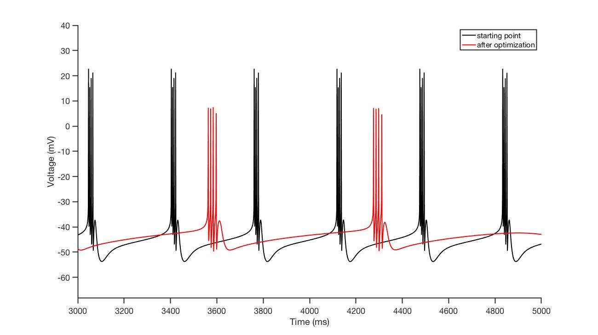

# procrustes

Force-fit [Xolotl]() objects so that they satisfy an arbitrary set of constraints. 

 

# Installation 

Get this repo from within `MATLAB` using my package manager:

```
% copy and paste this code in your MATLAB prompt
urlwrite('http://srinivas.gs/install.m','install.m'); 
install sg-s/srinivas.gs_mtools % you'll need this
install sg-s/procrustes 
install sg-s/xolotl
```

or use git if you plan to develop this further: 

```
git clone https://github.com/sg-s/srinivas.gs_mtools
git clone https://github.com/sg-s/procrustes
git clone https://github.com/sg-s/xolotl
```

Finally, make sure you [configure MATLAB so that it is set up to delete files permanently](https://www.mathworks.com/help/matlab/ref/delete.html). Otherwise you will end up with a very large number of temporary files in your trash!


# Usage 

Set up a `xolotl` object. (See [this]() for details)

Create a  `procrustes` object.

```
p = procrustes;
```

Configure the object and define a function and a target to minimize. Here, in this example, we're going to double the period of the neuron while keeping the # of spikes/burst the same.

```matlab
p.x = x;
% configure 
p.f = {@p.burstPeriod, @p.nSpikesPerBurst};
p.targets = [714, 4]; 
p.weights = [100, 100];
```

We want to vary all maximal conductances simulateously: 

```matlab
p.parameter_names = {'AB.NaV.gbar','AB.CaT.gbar','AB.CaS.gbar','AB.ACurrent.gbar','AB.KCa.gbar','AB.Kd.gbar','AB.HCurrent.gbar'};

p.seed = [1830 23 27 246 980 610 10];
p.lb = 0*p.seed;
p.ub = 2e3*ones(1,7);

```

Now run the optimization algorithm:

```matlab
g = p.fit;
```

This is what the result looks like. Note that the fit `xolotl` object satisfies our constraints (its period is doubled, but the number of spikes/burst is the same).

 


# Benchmarks 

| Task | Time | # evaluations | Hardware and parallelism |
|----- | ----- | ---- | --- |
| Double the period of a bursting neuron | 20 s | 526 | 12-core Mac Pro (Late 2013) using all cores |
| Double the period of a bursting neuron | 48 s | 526 | 12-core Mac Pro (Late 2013) using 1 thread |
| Double the # of spikes/burst | 21 s | 664 | 12-core Mac Pro (Late 2013) using all cores |

# License

`procrustes` is free software. GPL v3. 